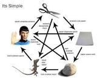
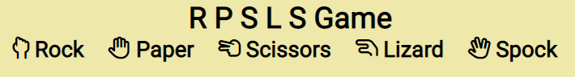
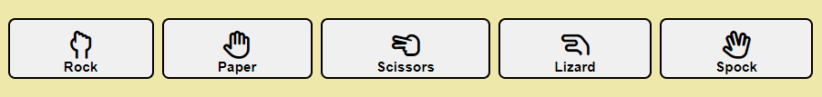
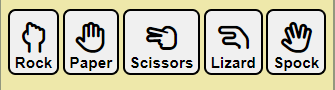

image.png

https://siobhain.github.io/rpslsgame/

# RPSLSGame
RPSLSGame is a  Rock Paper Scissors Lizard Spock Game by Siobhan O'Brien as part of PP2 for CI

#Introduction

As part of PP2 for CI I chose to create a RPSLS game.  The game starts when the user clicks on one of the hand icons/buttons.  
https://ui.dev/amiresponsive

##About RPS
Rock paper scissors is a hand game usually played between two people, in which each player simultaneously forms one of three shapes with an outstretched hand. These shapes are "rock" (a closed fist), "paper" (a flat hand), and "scissors" (a fist with the index finger and middle finger extended, forming a V).

The game has three possible outcomes: a draw, a win or a loss. A player who decides to play rock will beat another player who has chosen scissors ("rock crushes scissors" or "breaks scissors" or sometimes "blunts scissors"[4]), but will lose to one who has played paper ("paper covers rock"); a play of paper will lose to a play of scissors ("scissors cuts paper"). If both players choose the same shape, the game is tied and is usually immediately replayed to break the tie. The game spread from China while developing different variants in signs over time.

Rock paper scissors is often used as a fair choosing method between two people, similar to coin flipping, drawing straws, or throwing dice in order to settle a dispute or make an unbiased group decision. 

## CONTENTS

* [User Experience](#user-experience-ux)
  * [User Stories](#user-stories)

* [Design](#design)
  * [Colour Scheme](#colour-scheme)
  * [Typography](#typography)
  * [Imagery](#imagery)
  * [Wireframes](#wireframes)

* [Features](#features)
  * [General Features on Each Page](#general-features-on-each-page)
  * [Future Implementations](#future-implementations)
  * [Accessibility](#accessibility)

* [Technologies Used](#technologies-used)
  * [Languages Used](#languages-used)
  * [Frameworks, Libraries & Programs Used](#frameworks-libraries--programs-used)

* [Deployment & Local Development](#deployment--local-development)
  * [Deployment](#deployment)
  * [Local Development](#local-development)
    * [How to Fork](#how-to-fork)
    * [How to Clone](#how-to-clone)

* [Testing](#testing)

* [Credits](#credits)
  * [Code Used](#code-used)
  * [Content](#content)
  * [Media](#media)
  * [Acknowledgments](#acknowledgments)

## UX/UI Section
### Intention of this game, explain goal of game
### design choices font colors
I decided for very simple lines in this game as I wanted to spend the majority of time and effort on javascript.  I started with simple HTML and little CSS having placeholders for the data I needed to get from the DOM and data that needed to be written to the DOM.  I used gaudy colors in the development/test stage to make it easier to identify but all these will be removed before final deployment. 

I chose the google font Robtot for its clear lines and east of readability
I chose small palette of pale colors so as not to distract user from the game

Inkeeping with the simple lines I chose to use fontawesome icons for the game hand gestures as follows

I made a simple favicon from the Rock Paper Scissors hand gesture, I decided against adding the Lizard & Spock hand gestures as it got too crowded & difficult to distunguish each icon.

As I could not ascertain how long the javascript would take I started with the simpiler Rock Paper Scissors game with the intention to get that working before I added the Lizard & Spock. This worked out well as adding Lizard & Spock resulted in additions only to the Switch statement in findWinners function.  Naming the functions that were needed before starting any code was also great advice by the LMS.

### wireframes 

User Stories & Acceptance Criteria
A US is an informal general explanation of a software feature written from the prespective of an end use, its purpose is to articulate how a how s/w feature will provide value to the customer
as per Daisy McGitt in S/W test webinar
Format of a user story
As a <who> I want to <what> so that I can <why>
Acceptance Criteris - happy path is way it normally works and alternative sometime referred to as sad path ...ie user put in incorrect data 

As a first time user
I want to find out about this game so I can have a go at it
I want to play the game so i can see if I can beat the computer
I want to know each time i take a turn who wins the turn and what did the computer pick

#

As a returning user 
I want to just get on and play the game

As an owner
I want to make the game intresting and simple for others to play

user feedback
I want users to knwo the result at the end of each turn and end of each round.

Type of tests
unit test
systems test - evaluate the entire application
regression test - rerun non functional test, like when new functionality added it caused side effects and broke something else  
consider person looking at this after u ahs no idea baout the applicaiton

No value to be gained by adding a navbar so decided not to include, I have on the advice of my mentor included a footer which contains social media icons and the line that the game is for educational purposes.
## CREDITS

RPS rules & diagram courtesy of : https://en.wikipedia.org/wiki/Rock_paper_scissors
RPSLS rules & diagram courtesy of : https://www.instructables.com/How-to-Play-Rock-Paper-Scissors-Lizard-Spock

How To Create a Modal Box : https://www.w3schools.com/howto/howto_css_modals.asp

===============================================================================================================

## Features should incl Name, Description, how it works, screenshot, value to the user

#### Game footprint

Please take game footprint to mean both the header and body sections of html, both have the same background-color of pale yellow. The area outside of the game footprint is coloured a pale moss green.

RPSLS is a small game, it does not need much screen space. However, concerning the screen width, I did not want to have to use several media queries to cater for different screen widths. On mobile for example I want to make use of most of the width but once width get to approx 500px that plenty size for the game so I want to cap game width at 500px.  I used the width: min(500px, 90%).  I did succumb to one media query for screens > 1000px and increased the width to 800px.

#### Header

The header section is made up of a H1 Name & H2 tagline.  H1 contains shorthand for the name of the game using the 1st letter of each hand gesture Rock Paper Scissors Lizard Spock, so RPSLS Game.  The subheader in H2 is considered the tag line, It contains the icon & name, both are contained in a span with {white-space: nowrap} so they are presented as a pair when the browser needs to render the H2 tagline onto 2nd/3rd line. Also made use of two &nbsp to ensure adequate separation from next/previous item.  These efforts are an attempt to get user used to the icons used for each hand gesture.

#### Game Buttons
These are the 5 hand gestures that are central to the game, below is a screenshot from desktop 

& from a mobile 320px screen

The 5 buttons are displayed on a grid with automatic column sizes for each button, The 5 buttons fit on screen from 300px to 
All 5 gameButtons are white background with black font detailing both the icon and the name of the hand gesture.  The icon is double the font-size (at 2em) than the name underneath. The button corners are rounded slightly with a border-radius of 0.5em. On hover the background changes to a soft yellow color (a shade darker than the game background color) & alerts the user that it can be clicked. Once the Dom is loaded js adds a 'click' eventListener to each of these ganeButtons.  

how did u make favicon
### Existing Features

- __The Footer__ 

### Future Features

## Testing 
show that u ahve conducted enough test to believe that game works well
go over features and ebsure they all work as intended
how does project work on different brpowsers and screen sizes

### Validator Testing
html W3C validator
css jigsaw
js

### Unfixed Bugs

## Deployment

## Credits 

RPS rules & diagram courtesy of : https://en.wikipedia.org/wiki/Rock_paper_scissors
RPSLS rules & diagram courtesy of : https://www.instructables.com/How-to-Play-Rock-Paper-Scissors-Lizard-Spock

How To Create a Modal Box : https://www.w3schools.com/howto/howto_css_modals.asp

===============================================================================================================

### Content 

### Media

## Other General Project Advice
  - [HTML & CSS Coding Best Practices](https://medium.com/@inceptiondj.info/html-css-coding-best-practice-fadb9870a00f)
  - [Google HTML/CSS Style Guide](https://google.github.io/styleguide/htmlcssguide.html#General)

# List of features
# UX/UI
# Testing
# Deployment & Local Development

### Deployment

The game is deployed using GitHub Pages - 

###### Steps to deploy using github pages 
Login to Github
Navigate to the github repo https://github.com/siobhain/rpslsgame
In the repo, click on the Settings wheel
Om the left hand side click on Pages 
From the source dropdown elect the main branch and save, the game is now being deployed & may take a few minutes to eb fully loaded
The live link can be found here - https://siobhain.github.io/rpslsgame/

### Local Development

##### How to fork

To fork the repo

Login to Github
Navigate to the github repo https://github.com/siobhain/rpslsgame
Click on the fork dropdown on top righthand side
Click on the +(plus) Create a new repo

##### How to clone

To clone the repo

Login to Github
Navigate to the github repo https://github.com/siobhain/rpslsgame
Click on the Code dropdown, In the Local tab Choose one of  HTTPS SSH or GitHub CLI
Copy the link shown 
Open the terminal in your code editor and navigate to the location you want to use for the clone
Type git clone and paste the link/command you copied from GitHub 

# Citation of ALL sources(code, images, text)
# Future features 
