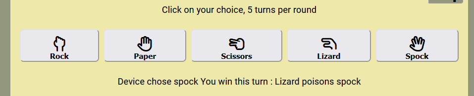
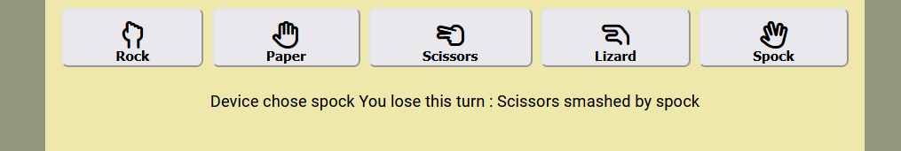
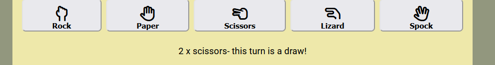
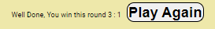

#  RPSLSGame

Live Site : https://siobhain.github.io/rpslsgame/

#  Introduction to RPSLSGame

RPSLSGame is a javascript implementation of the Rock Paper Scissors Lizard Spock Game. It is targeted at the person who needs to make a simple snap decision (like where to go for lunch) when they are probably on their own without a coin to flip. They play against the device running the game. The game starts when one of the 5 hand gestures is clicked.  The user can play just one turn or play a round of 5 turns and will be advised of win lose or draw at the end of each turn and round. Here is a screenshot of the home page

 The game may also interest people who are starting to learn javascript and want to see how it can manipulate the DOM. 

---
***
## Background Information
This section contains information about these two hand gesture games in case you have not come across them

### Rock Paper Scissors
In this hand gesture game of chance each player will simultaneously form one of 3 shapes with their hand which are either -

* a closed fist - **Rock**
* a flat hand - **Paper**
* a fist with index and middle finger extended forming a V shape - **Scissors**

The game has three possible outcomes: win lose or draw according to this triangular diagram :

### Rock Paper Scissors Lizard Spock

This game first appeared in the American TV show The big bang theory & is a variation of the Rock Paper Scissors game with the addition of 2 more hand gestures - yep you have guessed it Lizard & Spock

* flat hand with middle and ring fingers parted - **Spock**
* form the hand into a sockpuppet-like mouth - **Lizard**

Again the game has three possible outcomes:  win lose or draw according to this slightly mnore complicated triangular diagram below :

---
***

* [User Experience](#user-experience-ux)
  * [User Stories](#user-stories)
  

As a first time user
1. I want to find out about this game so I can have a go at it
1. I want to play the game so I can see if I can beat the computer
1. I want to know each time I take a turn who wins the turn and what did the computer pick

As a returning user 
1. I want to just get on and play the game

As an owner
1. I want to make the game simple for others to play
1. I want user to know the result at the end of each turn and end of each round.

### FEATURES
In this section, you should go over the different parts of your project, and describe each in a sentence or so. You will need to explain what value each of the features provides for the user, focusing on who this website is for, what it is that they want to achieve and how your project is the best way to help them achieve these things.

## CONTENTS

* [User Experience](#user-experience-ux)
  * [User Stories](#user-stories)

* [Design](#design)
  * [Colour Scheme](#colour-scheme)
  * [Typography](#typography)
  * [Imagery](#imagery)
  * [Wireframes](#wireframes)

* [Features](#features)
  * [General Features on Each Page](#general-features-on-each-page)
  * [Future Implementations](#future-implementations)
  * [Accessibility](#accessibility)

* [Technologies Used](#technologies-used)
  * [Languages Used](#languages-used)
  * [Frameworks, Libraries & Programs Used](#frameworks-libraries--programs-used)

* [Deployment & Local Development](#deployment--local-development)
  * [Deployment](#deployment)
  * [Local Development](#local-development)
    * [How to Fork](#how-to-fork)
    * [How to Clone](#how-to-clone)

* [Testing](#testing)

* [Credits](#credits)
  * [Code Used](#code-used)
  * [Content](#content)
  * [Media](#media)
  * [Acknowledgments](#acknowledgments)

## UX/UI Section
### Intention of this game, explain goal of game
### design choices font colors
It a pretty simple game so I decided for very simple lines in presentation of this game,  I wanted to spend the majority of time and effort on javascript (js).  I started with basic html/css layout with placeholder div/spans etc for the data js exchanges with the DOM I used gaudy colors in the development/test stage to make it easier to identify counters etc but all these removed once js finished & before final deployment. 

#### Fonts Icons & Colors
I chose the google font Roboto for its clear lines and east of readability
I chose small palette of pale colors so as not to distract user from the game.

INSERT PALETTE MOSS GREEN AND THE 2 YELLOWS BALCK AND WHITE AND ONE RED

Inkeeping with the simplicity of the game I chose to use fontawesome icons for the game hand gestures.  Here is an legend from the Help section of the game :

### Favicon
I made a simple favicon from the 3 Rock Paper Scissors hand gestures, I decided against adding the Lizard & Spock hand gestures as it got too crowded & difficult to distunguish each icon. Here is the favicon : 

#### Development Cycle
I started with the simplier Rock Paper Scissors game with the intention to get that working before I added the complications of Lizard & Spock. This worked out well - in fact adding Lizard & Spock resulted in additions only to the `switch` statement in `findWinners` function. Before coding I thought that the RPS game logic would be an good use case for Switch/Case statements so that was always in my head when deciding what js functions were needed. Naming the js functions that were needed before starting any code was also great advice from the LMS(Mark). Initally I created the following empty functions 

 * `runGame`
 * `findWinner`
 * `incrementDeviceWins`
 * `incrementUserWins`
 * `incrementDraw`
 * `displayResults`

I did not know at that early stage what parameters each function would use/return. During development I added another function 

 * playAgain

 The `playAgain` is used to give user an option to replay the game.

####  `runGame(userHand)` 
This is the main function of the RPSLS game, It is fired whenever the user clicks on one of the gameButtons (ie Rock, Paper... etc) It takes in the name of the game Button clicked by the user (named `userHand`) & does the following

  1. Randomly assign a device option to variable named `deviceHand`
  1. Compare both values via `===` and if matching then its a draw
  1. Otherwise `findWinner()` is called to determine the winner
  1. The winner is returned from `findWinner` in `resultText`
  1. Get the nummebr of turns from the dom in a span with `Id= turn` 
  1. increment the number of turns & write counter to the Dom
  1. write turn results to `winorloseTurn` div
  1. check if it is 5th turn & if so the round is finished so call `displayResults()`

 #### `findWinner(userHand, deviceHand)` 
 This function is called by `runGame` when user and device choices are different options. It is not called if matching options are chosen (ie Rock & Rock are chosen).  Each player has 5 options so with 2 players there are 25 permutations,  subtract the 5 matching options and that leaves 20 unique options that need to be catered for in this functions switch.case statement. 
 
 The function takes 2 parameters, the user chosen option `userHand` and the randomly assigned device option `deviceHand` & does the following

 1. Both parameters are concatenated into one string called `result`
 1. A `switch` statment with the 20 options is presented and js will match with the chosen `result`
 1. Its either a win for the user or win for device so appropriate increment function is called & appropriate feedback to the user is created
 1. The function returns the user feedback in string format
1.  There is a default case to cater for problems.

#### `incrementXXXX`
There are 3 increment functions whose code is mainly taken from the Code institute Love Maths `incrementScore()` function.

 1. `incrementDeviceWins`
 1. `incrementUserWins`
 1. `incrementDraw`

 An interesting fact is that increment needs to be BEFORE the variable as javascript  will increment `oldScore` before writing to dom, if its `oldScore++` then js writes oldScore to dom and then increments it!

#### `displayResults()`
This function is called by `runGame` once 5 turns have been taken
The aim is 3 fold
    1. Let the user know the round is finished
    1. Let the user know the results of the round
    1. Give the user the option to play again

It is necessary to disable the 5 gameButtons while the user decides to play again,  the results are taken from the dom & Template literals (backquotes) provide a way to interpolate `${result}` into string for output to the `div  id=roundResult`.

#### `playAgain()`

This function is fired once the user hits the `Play Again button`
The "Play Again" button is presented to the user by `displayResults()` function once the round of 5 turns is finished.
This function does the following :
  1. re-enable the 5 Game buttons : Rock Paper Scissors Lizard & Spock
  1. Reset dom counters : `turn, draw, user, device`
  1. Reset dom text : `winorloseTurn roundResults`

### winorloseTurn in index.html

This div is filled with 2 blank lines ` ` on page load :

    
  

The js function runGame writes results of a turn to this div
    
      document.getElementById("winorloseTurn").innerText = resultText;
Here are some examples

### roundResults in index.html
The game plays 5 turns to a round, once all 5 truns are taken this 'roundResults' function is called by 'runGame' in order to inform the user the game is finnished and the overall winner and an option to play again.

### helpButton & helpModal

Clicking on the Help buttons opens the following modal that covers the game footprint

#### EventListeners
Once DOM is loaded add eventlisteners &/or handle specific user actions.

  There are 5 gameButtons (for Rock, Paper...etc) & a helpButton (which fires popup modal for game instructions) so listeners are needed for a `click` action to each of these buttons.

  All buttons are retrieved from the dom by `getElementsByTagName`

    let buttons = document.getElementsByTagName("button");

When any of the gameButtons are clicked the `runGame` function is invoked

        button.addEventListener("click", function () {
          let userHand = this.getAttribute("data-type");
          runGame(userHand); 
          }

However there is different treatment if its the helpButton, in this case when the helpButton is clicked I want to invoke the modal by setting the `display` attribute to `block` & that along with CSS z-index=1 will ensure it appears on top of the game

    if (button === helpButton) {
      button.addEventListener("click", function () { 
        helpModal.style.display = "block";
       
        for (var i = 1; i < 6; i++) {
          buttons[i].disabled = true;
        }
      });
  
  I have used a modal from w3schools https://www.w3schools.com/howto/howto_css_modals.asp to help with this development.
  

### wireframes 

User Stories & Acceptance Criteria
A US is an informal general explanation of a software feature written from the prespective of an end use, its purpose is to articulate how a how s/w feature will provide value to the customer
as per Daisy McGitt in S/W test webinar
Format of a user story
As a <who> I want to <what> so that I can <why>
Acceptance Criteris - happy path is way it normally works and alternative sometime referred to as sad path ...ie user put in incorrect data 

As a first time user
I want to find out about this game so I can have a go at it
I want to play the game so i can see if I can beat the computer
I want to know each time i take a turn who wins the turn and what did the computer pick

#

As a returning user 
I want to just get on and play the game

As an owner
I want to make the game intresting and simple for others to play

user feedback
I want users to knwo the result at the end of each turn and end of each round.

Type of tests
unit test
systems test - evaluate the entire application
regression test - rerun non functional test, like when new functionality added it caused side effects and broke something else  
consider person looking at this after u ahs no idea baout the applicaiton

No value to be gained by adding a navbar so decided not to include, I have on the advice of my mentor included a footer which contains social media icons and the line that the game is for educational purposes.

# Testing
Testing document can be found [here](TESTING.md)

## Technologies used

- [HTML5](https://en.wikipedia.org/wiki/HTML5) 
- [CSS3](https://en.wikipedia.org/wiki/CSS)
- [Javascript Visualizer](https://pythontutor.com/visualize.html#mode=edit)
- [GitPod](https://gitpod.io/) 
- [GitHub](https://github.com/)
- [Am I Responsive](http://ami.responsivedesign.is/) 
- [Favicon.io](https://favicon.io/favicon-generator/)
- [Font Awesome](https://fontawesome.com/)

## CREDITS

- Referenced articles & sought guidance on the following :
  * MND https://developer.mozilla.org/en-US/
  * W3Schools https://www.w3schools.com/
  * Stack Overflow https://stackoverflow.com/
  * Code Institute LMS, github templates & Slack Channels
  * Kevin Powell Channel https://www.youtube.com/@KevinPowell
- RPS rules & diagram courtesy of https://en.wikipedia.org/wiki/Rock_paper_scissors
- RPSLS rules & diagram courtesy of https://www.instructables.com/
- How To Create a Modal Box https://www.w3schools.com/howto/howto_css_modals.asp

===============================================================================================================

## Features should incl Name, Description, how it works, screenshot, value to the user

#### Game footprint

Please take game footprint to mean both the header and body sections of html, both have the same background-color of pale yellow. The area outside of the game footprint is coloured a pale moss green.

WIDTH
RPSLS is a small game, it does not need much screen space. However, concerning the screen width, I did not want to have to use several media queries to cater for different screen widths. On mobile for example I want to make use of most of the width but once width get to approx 500px that plenty size for the game so I want to cap game width at 500px.  I used the width: min(500px, 90%).  I did succumb to one media query for screens > 1000px and increased the width to 800px.  

POSITION
The game is centered horizontally.I set padding at the top of the game footprint to be 5vh, which will be 5% of the viewport height, this is adequate for small screen devices but on larger screen it would be better to center the game in the screen but given time constraints I settled with 20% viewport padding (20vh) on screens wider than 1000px.

#### Header

The header section is made up of a H1 Name & H2 tagline.  H1 contains shorthand for the name of the game using the 1st letter of each hand gesture Rock Paper Scissors Lizard Spock, so RPSLS Game.  The subheader in H2 is considered the tag line, It contains the icon & name, both are contained in a span with {white-space: nowrap} so they are presented as a pair when the browser needs to render the H2 tagline onto 2nd/3rd line. Also made use of two &nbsp to ensure adequate separation from next/previous item.  These efforts are an attempt to get user used to the icons used for each hand gesture.

#### Game Buttons
These are the 5 hand gestures that are central to the game, below is a screenshot from desktop 

& from a mobile 320px screen

The 5 buttons are displayed on a grid with automatic column sizes for each button, The 5 buttons fit on screen from 300px 

All 5 gameButtons are white background with black font detailing both the icon and the name of the hand gesture.  The icon is double the font-size (at 2em) than the name underneath. The button corners are rounded slightly with a border-radius of 0.5em. On hover the background changes to a soft yellow color (a shade darker than the game background color) & alerts the user that it can be clicked. Once the Dom is loaded js adds a 'click' eventListener to each of these ganeButtons.  

### Existing Features

#### Footer
The footer has social media icons and a message that this is an educational page.

### Future Features
center game box on screen
## Testing 
show that u ahve conducted enough test to believe that game works well
go over features and be sure they all work as intended
how does project work on different brpowsers and screen sizes

### Validator Testing
html W3C validator
css jigsaw
js

### Unfixed Bugs

#### hidden element
I wanted to hide the scoreboard (`id=score-area`) at game start but could not get it working.  I first ran into problem trying to read the value of an element that was 'visibility: hidden' with 

    let oldTurn = parseInt(document.getElementById("turn").innerText);

 which would eventually lead to `NaN` when tried to increment the `oldTurn`. Eventually I found that using `innerHTML` rather than `innerText` solved this problem. However the real problem came when I tried to check if the element was hidden with this little if statement

    let scorearea = document.getElementById("score-area");

    if (scorearea.style.visibility === 'hidden') {
            scorearea.style.visibility = 'visible';
    }

  I had tried it out in W3Schools tryit ASP & it  all worked perfectly fine but I could not get it to work within my game.  I changed `score-area` from `Class` to `Id`, I tried different html tags such as `
 & <section>` & numerous console logs. Even this simple alert was blank

      alert(document.getElementById("score-area").style.visibility);

  
Alas, reluctantly I've had to leave the score-area visible on page load otherwise this README would be incomplete. (of coarse itching to get back to it)
 
#### FAINT LINE  
In the amiresponsive desktop screenshot there appears to be a faint line under the `<h1>` header RPSLS Game. There is an even fainter line under the `<h2>` tagline. I do not have any borders, margin, outlines on either of these elements so I do not know where these lines are coming from. I'm not even sure if this is a bug or a sympton of simulation as they are not visible on live site.

## Deployment

# List of features
# UX/UI
# Testing

## Deployment & Local Development
The game is deployed using GitHub Pages - 
#### Steps to deploy using github pages 
1. Login to Github
1. Navigate to the github repo https://github.com/siobhain/rpslsgame
1. In the repo 
  * click on the Settings wheel
  * On the left hand side click on Pages 
  * From the source dropdown elect the main branch and save, the game is now being deployed & may take a few minutes to be fully loaded
    * The live link can then be found here https://siobhain.github.io/rpslsgame/

### Local Development
#### How to fork
To fork the repo
1. Login to Github
1. Navigate to the github repo https://github.com/siobhain/rpslsgame
1. Click on the fork dropdown on top righthand side
1. Click on the +(plus) Create a new repo

#### How to clone
To clone the repo
1. Login to Github
1. Navigate to the github repo https://github.com/siobhain/rpslsgame
1. Click on the Code dropdown, In the Local tab Choose one of  HTTPS SSH or GitHub CLI &  Copy the link/command shown 
1. Open the terminal in your code editor and navigate to the location you want to use for the clone
1. Type git clone and paste the link/command 
