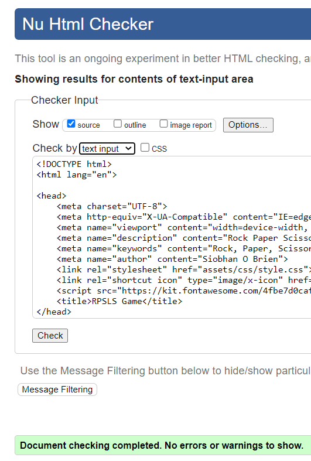
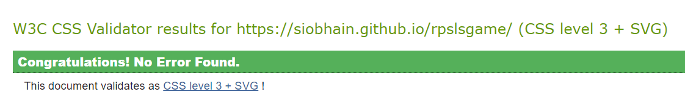
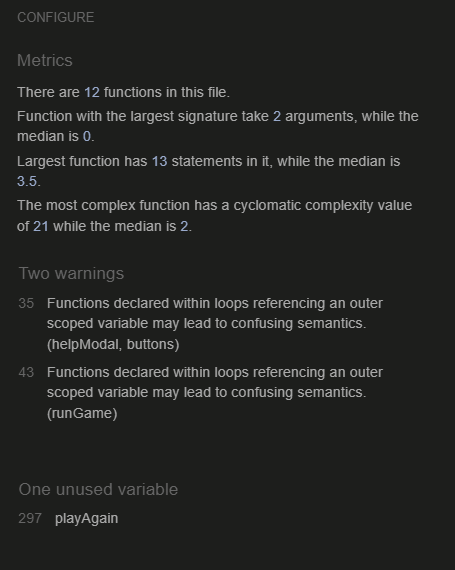

<h1> Testing For Boodle </h1>

# Table of Contents
- [Table of Contents](#table-of-contents)
  - [Manual Testing](#manual-testing)
  - [Browser Testing](#browser-testing)
  - [Device Testing](#device-testing)
  - [Validator Testing](#validator-testing)
  - [Lighthouse Testing](#lighthouse-testing)
  - [Accessibility Testing](#accessibility-testing)

## Manual Testing

Feature Tested | Expected Result | Actual Result | Pass/Fail
---------------|-----------------|---------------|----------

## Browser Testing 
Browser Tested | Working Status
---------------|---------------
Chrome | Works as expected
Firefox | Works as expected
Microsoft Edge | Works as expected
Mac OS Safari | Works as expected

## Device Testing
Device Tested | Working Status
--------------|---------------
iPhone 8 Plus | Works as expected

## Validator Testing

Test Type | Result | Comment
----------|----------------|-----
W3C HTML Validator |  | I needed to change all `<section>` to `
` as I do not have any headers within the game body element
W3C CSS Validator |  | n/a
JShint JavaScript Validator |  | 1. There are 2 warnings wrt line 35 & line 43, these are both in the area where I am setting up listeners on page load  1. There is unused variable playAgain, This is a function that is called from the html, It would be better to have an eventListener for this button 'click' function but time does not allow me to adjust this before submission

## Lighthouse Testing

Device | Result
-------|-------
Desktop| 
Mobile | 

## Accessibility Testing

Although there were three alerts during WAVE testing, I was not too worried about them as the first two were irrelevant to the website because it is a game and not a traditional webpage, and then the last one was not an issue as the music had no lyrics to transcript.