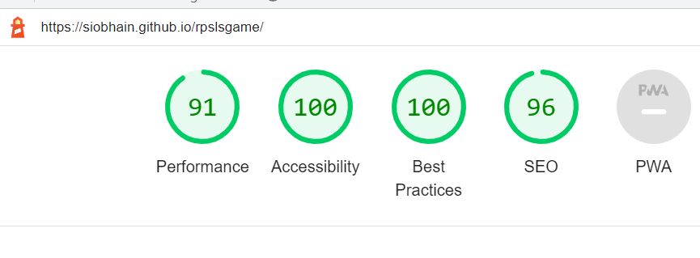

# Testing for RPSLS Game
  - [Unit and Manual Tests](#unit)
  - [User Story Testing](#user)
  - [Feature Testing](#feature)
  - [Browser Testing](#browser-testing)
  - [Validator Testing](#validator-testing)
  - [Lighthouse Testing](#lighthouse-testing)
  - [Accessibility Testing](#accessibility-testing)

---

## Unit and Manual Tests 
In this project when I mention unit tests I am referring to testing a small independent piece of code or function that mimics what I am trying to add to the game. So I carried out several unit tests in HTML, CSS & JS on multiple platforms such as the LMS Runnable example, W3Schools Try it, Python/JS Tutor & gitpod cli in order to get to speed & try out new code constructs/ideas before incorporating into the actual game. It was great to have so many learning resources to hand. 

In addition the following manual test were repeatively carried out whenever a new piece of functionality was added or changes were made to clear errors/warnings or for best practise.

|Test|Description|
|-----|-----|
|gameButtons| Each game button Rock, Paper...etc was clicked to check listener was working|
|Counters| The 4 counters, turn win lose draw checked that they are operating as expected|
|Turn Results|Check that each turn is generating the correct results, ie the correct case out of a possible 20 is selected & correct turn results presented to screen|
|Round results|Check that the final results at the end of the round is as it should be|
|Help button| Check that this button opens the help modal correctly
|Help close|  Checl that clicking on the xlose "X" on the help modal will close it and retuen to the game
|Click outside modal| Check that the helpmodal is closed|

### Responsive Tests
I used google dev tools to check for responsiviness on screen width sizes from 320px mobile size to 1600px desktop size. The game was build mobile first, It has a very small footprint. Hence I had the luxury of only having to be concerned with width, there are no settings for height.

## User Story Testing 
### First Time User

|User Story | Test | Expected Result| Actual|
|---------------|-----------------|---------------|---|
|I want to find out about this game so I can have a go at it|Click on the Help button| The help modal opens giving the user all the instructions needed to play the game|PASS|
|I want to play the game so I can see if I can beat the computer | Start clicking the game buttons to play a round & play 5 rounds| You win some rounds, You lose some rounds, You may draw|PASS|
|I want to know each time I take a turn who wins the turn and what did the computer pick|Click on a gameButton|Turn results are displayed on the screen telling user what the device placed & if they won or lsoe this turn, also note that the counters are updated|PASS|

### Returning User
 
|User Story | Test | Expected Result|Actual|
|---------------|-----------------|---------------|----|
|I want to just get on and play the game|Start ckicking on the gameButtons and play 5 turns to complete a round|The turn results are displayed on screen as each turn is taken and the rouns results are displayed at the ned of the round wqith the option to Play Again|PASS|

### Owner User Stories
 
|User Story | Test | Expected Result|Actual|
|---------------|-----------------|---------------|----|
|I want to make the game simple for others to play| Is the game easy to play|Load the game and click some buttons, You can see results of the game|PASS|
|I want user to know the result at the end of each turn and end of each round|Play a turn| The turn results are displayed on screen|PASS|
|I want user to know the result at the end of each round|Play a round|The round results are displayed on screen|PASS|

---

## Feature 

|Feature | Expected Result | Actual|
|-----|-----|-----|
|gameButtons disabled when round finishes|Game Buttons not cluickable & visibly disabled when round results are displayed|PASS|
|gameButton disabled when Help modal invoked|Defunct Feature since helpModal now covers majority of game footprint & gameButtons are no longer visible when helpModal is displayed|n/a|

---

## Browser Testing 
|Browser  | Result|
|---------------|---------------|
|Chrome | Works as expected|
|Firefox | Works as expected|
|Microsoft Edge | Works as expected|

---

## Validator Testing

|Test Type | Result | Comment|
|----------|:-----------:|-----|
W3C HTML Validator |  | In order to clear errors/warnings with this validator I had to change all `<section>` elements to `
` I do not have any headers within the game body elements, I have meangingful Class and Id names but did not require header in the likes of game-area score-area, Using div's & spans combined with lack of a nav bar point to poor scemantic markup on this site but it is such a small & simple game/site that it is probably not a major problem. I did include a footer but it is more as a semantic element rather than adding any value to the game. I intend to replace the scoial media icons on the footer with the tagline (the h2 in header) in order to imporve value of footer but not going to be done before submission.| 
|W3C CSS Validator |  | n/a|
|JShint JavaScript Validator |  |**Warnings** at line 35 & line 43, these are both in the area where I am setting up listeners on page load In both cases I am setting up a function to be invoked on 'click' of a button, the variables used inside these function are used elsewhere within the "page load" setup hence the warning, Since the game itself is not too complicated as variables are defined just a couple of lines above being used I think in this case it is acceptable & will not lead to confusion |
|JsHint continued|"|There is **unused variable `playAgain`**, This is a function that is called from the html, It would be better to have an eventListener for this button 'click' function but time does not allow me to adjust this before submission|
---

## Lighthouse Testing

|From  | Result|
|-------|-------|
|Desktop| |
|Mobile| |

## Accessibility Testing

|WAVE Results| 
|-------|
||

|Alert  | Comment|
|:-------:|-------|
| |Alert : `<noscript>`** but in the case of a browser not supporting js on this site the actual text content is accessible so I don't think there is need for an `aria label`.|
|"|Second alert is for the legend table in the helpModal as I do not ahve a `table head`. I purposely removed the `thead` several commits back as I did not see its value, its self explanatory what the table is in fact I probably should just have made this a `list` element!|
---