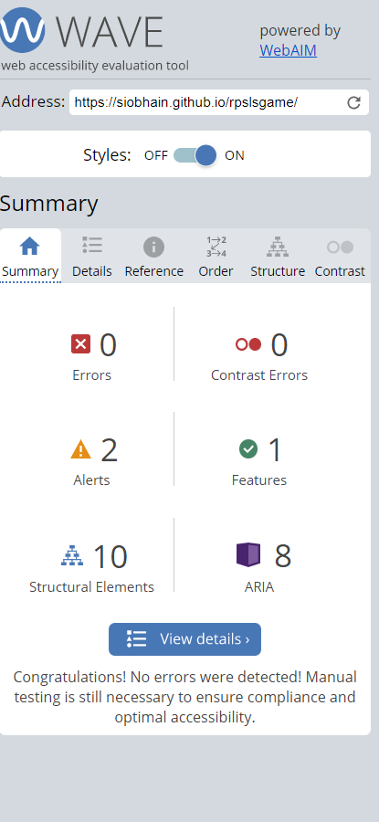

<h1> Testing For RPSLS Game </h1>

# Table of Contents
- [Table of Contents](#table-of-contents)
  - [Manual Testing](#manual-testing)
  - [Browser Testing](#browser-testing)
  - [Device Testing](#device-testing)
  - [Validator Testing](#validator-testing)
  - [Lighthouse Testing](#lighthouse-testing)
  - [Accessibility Testing](#accessibility-testing)

## Manual Testing

Feature Tested | Expected Result | Actual Result | Pass/Fail
---------------|-----------------|---------------|----------

## Browser Testing 
Browser Tested | Working Status
---------------|---------------
Chrome | Works as expected
Firefox | Works as expected
Microsoft Edge | Works as expected

## Device Testing
Device Tested | Working Status
--------------|---------------
iPhone 8 Plus | Works as expected

## Validator Testing

Test Type | Result | Comment
----------|----------------|-----
W3C HTML Validator |  | I needed to change all `<section>` to `
` as I do not have any headers within the game body element
W3C CSS Validator |  | n/a
JShint JavaScript Validator |  | **First** There are **2 warnings** wrt line 35 & line 43, these are both in the area where I am setting up listeners on page load In both cases I am setting up a function to be invoked on 'click' of a button, the variables used inside these function are used elsewhere within the "page load" setup hence the warning, Since the game itself is not too complicated as variables are defined just a couple of lines above being used I think in this case it is acceptable & will not lead to confusion **Second** There is **unused variable `playAgain`**, This is a function that is called from the html, It would be better to have an eventListener for this button 'click' function but time does not allow me to adjust this before submission

## Lighthouse Testing

Device | Result
-------|-------
Desktop| 

## Accessibility Testing

Result 
-------

 

Alert  | Comment
-------|-------

] |There are 2 alerts, **First for `<noscript>`** but in the case of a browser not supporting js on this site the actual text content is accessible so I don't think there is need for an `aria label`. **Second** is for the legend table in the helpModal as I do not ahve a `table head`. I purposely removed the `thead` I had used several commits back as I did not see its value, its self explanatory what the table is in fact I probably should just have made this a `list` element
